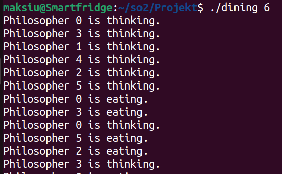

Dining Philosophers Problem - Documentation

1. General Description

The Dining Philosophers Problem is a classic synchronization problem in computer science that illustrates the challenges of managing shared resources (such as forks) among multiple threads (philosophers) without leading to deadlock or starvation.

Problem Statement:

There are N philosophers sitting around a circular table.

Each philosopher alternates between two states: thinking and eating.

Each philosopher requires two forks (one on the left and one on the right) to eat.

Philosophers must not hold onto forks indefinitely, and the system should avoid deadlocks and starvation.

This project provides an implementation of the Dining Philosophers Problem using std::thread and std::mutex in C++. The number of philosophers is provided as a command-line argument.

2. Threads Used in the Program

Each philosopher runs on a separate thread, meaning that the number of threads in the program is equal to the number of philosophers + 1.

List of Threads:

Main Thread:

Reads user input (number of philosophers) from the command line.

Initializes philosophers and forks (mutexes).

Spawns N threads for each philosopher to run their dine() function.

Joins all philosopher threads when they finish execution (won't happen).

Philosopher Threads (N):

Each philosopher continuously executes the think-eat-think cycle.

While eating, a philosopher acquires locks on two forks (mutexes) before proceeding.

Uses a print mutex to ensure synchronized console output.

3. Critical Sections and Synchronization

A critical section is a part of the program where shared resources (forks, console output) are accessed by multiple threads. Proper synchronization is necessary to prevent race conditions and ensure consistent program behavior.

Critical Sections in the Code:

1. Accessing Forks (Mutex Synchronization for Eating)

Location in Code: Inside eat() function.

What Happens: A philosopher must lock both forks (mutexes) before eating.

How It Is Solved:

Uses std::lock() to acquire both forks atomically, preventing deadlock.

std::lock_guard<std::mutex> ensures proper unlocking after eating.

2. Printing to Console (Mutex Synchronization for Output)

Location in Code: Inside log_state() function.

What Happens: Multiple philosopher threads may try to print at the same time, leading to garbled output.

How It Is Solved:

A global print_mutex is used to ensure only one philosopher prints at a time.

std::lock_guard<std::mutex> ensures the mutex is released after printing.

4. Solution Approach and How It Works

Initialization:

The program reads the number of philosophers from the command-line argument.

Initializes an array of std::mutex objects representing forks.

Creates N philosopher objects and spawns N threads for them.

Philosophers' Execution Cycle:

Thinking Phase: The philosopher "thinks" for a short duration (simulated with usleep).

Eating Phase:

The philosopher locks both adjacent forks.

Once acquired, it prints its state and "eats" for a short duration.

Releases the forks after eating.

The process repeats indefinitely.

Synchronization Mechanisms Used:

Fork Mutexes (std::mutex): Ensure exclusive access to forks.

Atomic Locking (std::lock): Prevents deadlock when acquiring two mutexes.

Lock Guard (std::lock_guard): Ensures proper release of mutexes after use.

Print Mutex (std::mutex): Ensures ordered and readable console output.

5. Example Execution and Expected Output

This output shows that philosophers alternate between thinking and eating, and printing is synchronized to prevent overlapping messages.

6. Summary

Threads: One thread per philosopher, plus the main thread.

Critical Sections: Fork access (to prevent deadlocks) and console printing (to avoid mixed output).

Synchronization: Achieved using std::mutex, std::lock, and std::lock_guard.

Deadlock Prevention: Atomic lock acquisition of two mutexes prevents circular wait conditions.

Starvation Prevention: Philosophers release forks after eating, ensuring fairness.

This implementation demonstrates how multi-threaded synchronization can be achieved using C++ std::thread and std::mutex, while correctly solving the Dining Philosophers Problem with proper deadlock handling. It avoids deadlocks by purely negating the resource holding aspect, which when happens with 3 other issues leads to deadlocks.

7 How to launch:
make
./dining <amount of philosophers> (as integer)